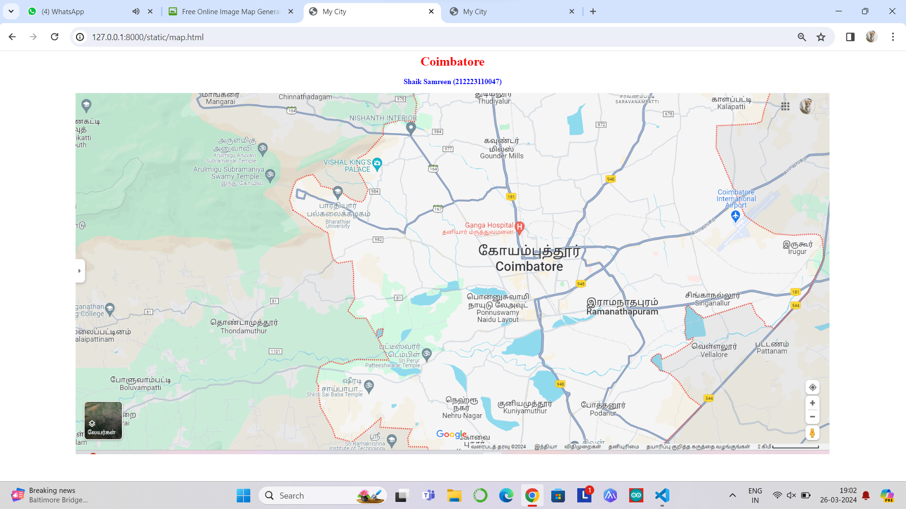
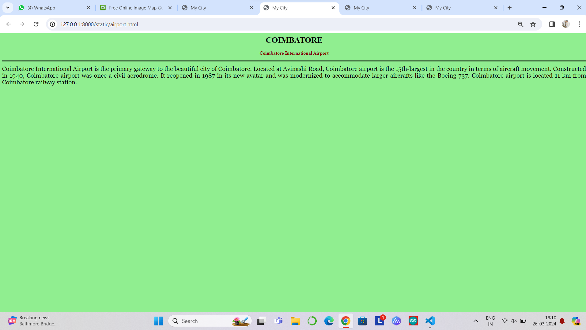
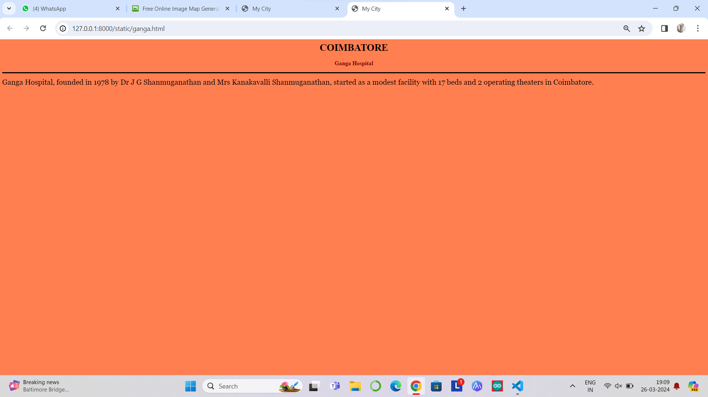
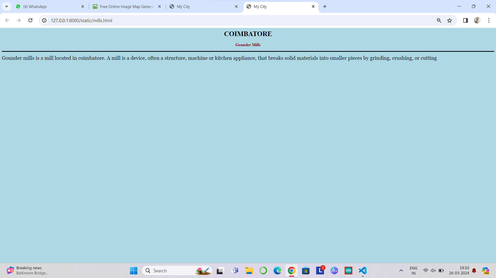
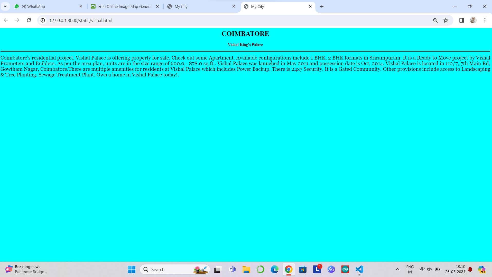

# Ex04 Places Around Me
## Date:26-03-2024

## AIM
To develop a website to display details about the places around my house.

## DESIGN STEPS

### STEP 1
Create a Django admin interface.

### STEP 2
Download your city map from Google.

### STEP 3
Using ```<map>``` tag name the map.

### STEP 4
Create clickable regions in the image using ```<area>``` tag.

### STEP 5
Write HTML programs for all the regions identified.

### STEP 6
Execute the programs and publish them.

## CODE
```
map.html

<html>
    <head>
        <title>
            My City
        </title>
    </head>
    <body>
        <h1 align="center">
            <font color="red"><b>Coimbatore</b></font>
        </h1>
        <h3 align="center">
            <font color="blue"><b>Shaik Samreen (212223110047)</b></font>
        </h3>
        <center>
            
<map name="MyCity">
    <area shape="rect" coords="100,100,900,900" href="expmap.html" title="My Home Town"</map>
    

    

<map name="image-map">
    <map name="image-map">
    
            <area target="_blank" alt="Ganga Hospital" title="Ganga Hospital" href="ganga.html" coords="921,303,1163,384" shape="rect">
            <area target="_blank" alt="VISHAL KING'S PALACE" title="VISHAL KING'S PALACE" href="vishal.html" coords="720,174,71" shape="circle">
            <area target="_blank" alt="Gounder Mills" title="Gounder Mills" href="mills.html" coords="1095,202,1021,189,1027,87,1090,69,1147,96,1161,157,1138,194" shape="poly">
            <area target="_blank" alt="Nehru Nagar" title="Nehru Nagar" href="nehru.html" coords="930,762,1035,840" shape="rect">
            <area target="_blank" alt="Coimbatore International Airport" title="Coimbatore International Airport" href="airport.html" coords="1677,276,60" shape="circle">
    
    </map>
</map>
        </center>
    </body>

</html>
```
airport.html
```
<html>
    <head>
        <title>My City</title>
    </head>
    <body bgcolor="lightgreen">
        <h1 align="center">
        <font color="black"><b>COIMBATORE</b></font>
        </h1>
        <h3 align="center">
        <font color="maroon"><b>Coimbatore International Airport</b></font>
        </h3>
        <hr size="3" color="black">
        <p align="justify">
        <font face="Georgia" size="5">
            Coimbatore International Airport is the primary gateway to the beautiful city of Coimbatore. Located at Avinashi Road, Coimbatore airport is the 15th-largest in the country in terms of aircraft movement. Constructed in 1940, Coimbatore airport was once a civil aerodrome. It reopened in 1987 in its new avatar and was modernized to accommodate larger aircrafts like the Boeing 737. Coimbatore airport is located 11 km from Coimbatore railway station.
        </font>
        </p>
    </body>
</html>
```
ganga.html
```
<html>
    <head>
        <title>My City</title>
    </head>
    <body bgcolor="coral">
        <h1 align="center">
        <font color="black"><b>COIMBATORE</b></font>
        </h1>
        <h3 align="center">
        <font color="maroon"><b>Ganga Hospital</b></font>
        </h3>
        <hr size="3" color="black">
        <p align="justify">
        <font face="Georgia" size="5">
            Ganga Hospital, founded in 1978 by Dr J G Shanmuganathan and Mrs Kanakavalli Shanmuganathan, started as a modest facility with 17 beds and 2 operating theaters in Coimbatore.
        </font>
        </p>
    </body>
</html>
```
mills.html
```
<html>
    <head>
        <title>My City</title>
    </head>
    <body bgcolor="lightblue">
        <h1 align="center">
        <font color="black"><b>COIMBATORE</b></font>
        </h1>
        <h3 align="center">
        <font color="maroon"><b>Gounder Mills</b></font>
        </h3>
        <hr size="3" color="black">
        <p align="justify">
        <font face="Georgia" size="5">
            Gounder mills is a mill located in coimbatore. A mill is a device, often a structure, machine or kitchen appliance, that breaks solid materials into smaller pieces by grinding, crushing, or cutting
        </font>
        </p>
    </body>
</html>
```
nehru.html
```
<html>
    <head>
        <title>My City</title>
    </head>
    <body bgcolor="pink">
        <h1 align="center">
        <font color="black"><b>COIMBATORE</b></font>
        </h1>
        <h3 align="center">
        <font color="maroon"><b>Nehru Nagar</b></font>
        </h3>
        <hr size="3" color="black">
        <p align="justify">
        <font face="Georgia" size="5">
            Nehru Nagar is situated in the eastern part of Coimbatore, separated by the Noyyal River in the west from other parts of the city. Some of the prominent areas around MGR Nager, Kumudham Nagar, Rangaswamy gounder pudur, Veeriyampalayam, and Kanji maa nagar. Robust social infrastructures and have made the locality one of the major residential localities of Coimbatore. GKD Nagar, Sharp Nagar, and TNHB Nagar are the suburbs of the Nehru Nagar locality. The neighborhood is experiencing a horizontal growth, with few apartments. La Casa Apartment, Venky's Apartment, Airport Residency, and Diamond Dazzle Apartment are some of the prominent residential buildings in this suburb.
        </font>
        </p>
    </body>
</html>
```
vishal.html
```
<html>
    <head>
        <title>My City</title>
    </head>
    <body bgcolor="cyan">
        <h1 align="center">
        <font color="black"><b>COIMBATORE</b></font>
        </h1>
        <h3 align="center">
        <font color="maroon"><b>Vishal King's Palace</b></font>
        </h3>
        <hr size="3" color="black">
        <p align="justify">
        <font face="Georgia" size="5">
            Coimbatore's residential project, Vishal Palace is offering property for sale. Check out some Apartment. Available configurations include 1 BHK, 2 BHK formats in Srirampuram. It is a Ready to Move project by Vishal Promoters and Builders. As per the area plan, units are in the size range of 600.0 - 878.0 sq.ft.. Vishal Palace was launched in May 2011 and possession date is Oct, 2014. Vishal Palace is located in 112/7, 7th Main Rd, Gowtham Nagar, Coimbatore.There are multiple amenities for residents at Vishal Palace which includes Power Backup. There is 24x7 Security. It is a Gated Community. Other provisions include access to Landscaping & Tree Planting, Sewage Treatment Plant. Own a home in Vishal Palace today!.
        </font>
        </p>
    </body>
</html>
```

## OUTPUT







## RESULT
The program for implementing image maps using HTML is executed successfully.
